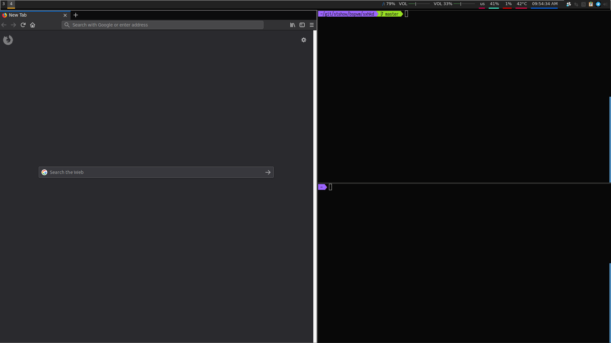

# bspwm

bspwm configs

##### Screenshot:



### Polybar
https://github.com/jaagr/polybar

```
$ git clone --branch 3.2 --recursive https://github.com/jaagr/polybar
$ mkdir polybar/build
$ cd polybar/build
$ cmake ..
$ sudo make install

$ ./build.sh
```

Then copy the `polybar` folder into ~/.config. 

### bspwm
https://github.com/baskerville/bspwm

##### The below is a TL;DR of this:
https://github.com/windelicato/dotfiles/wiki/bspwm-for-dummies

#### Build Deps:

#### Ubuntu / Debian

```
sudo apt-get install xcb libxcb-util0-dev libxcb-ewmh-dev libxcb-randr0-dev libxcb-icccm4-dev libxcb-keysyms1-dev libxcb-xinerama0-dev libasound2-dev libxcb-xtest0-dev gcc make
```

#### Arch Linux

```
sudo pacman -S libxcb xcb-util xcb-util-keysyms xcb-util-wm gcc make
```

#### Fedora

```
sudo dnf groupinstall "Development Tools"
sudo dnf install xcb-util-devel xcb-util-keysyms-devel xcb-util-wm-devel alsa-lib-devel dmenu rxvt-unicode terminus-fonts
```


```
git clone https://github.com/baskerville/bspwm.git
git clone https://github.com/baskerville/sxhkd.git

cd bspwm
make
sudo make install

cd ../sxhkd
make
sudo make install
cd ../

mkdir ~/.config/bspwm
mkdir ~/.config/sxhkd

cp bspwm/examples/bspwmrc ~/.config/bspwm/bspwmrc
chmod +x ~/.config/bspwm/bspwmrc

cp bspwm/examples/sxhkdrc ~/.config/sxhkd/sxhkdrc

sudo cp contrib/freedesktop/bspwm.desktop /usr/share/xsessions/
```

If you want to try it out, restart your display manager and you should see bspwm. Otherwise, proceed

### Once bspwm and polybar are installed: 

```
cd ~/.config
git clone https://github.com/stshow/bspwm.git
```

Restart your display manager and login. 


## Features:

1. Polybar
2. Scratchpad examples (Slack and Telegram). 

## To Do:

1. Make the config more "universal" with regard to monitors. (Currently you will need to tweak the `bspwmrc` for your displays.) This todo can likely be accomplished with either of the following tools:

    a. https://github.com/Ventto/mons/

    OR 

    b. https://github.com/wertarbyte/autorandr & https://www.reddit.com/r/bspwm/comments/53x8qh/for_those_of_you_who_use_a_laptop_and_external/d7xv9yu/
